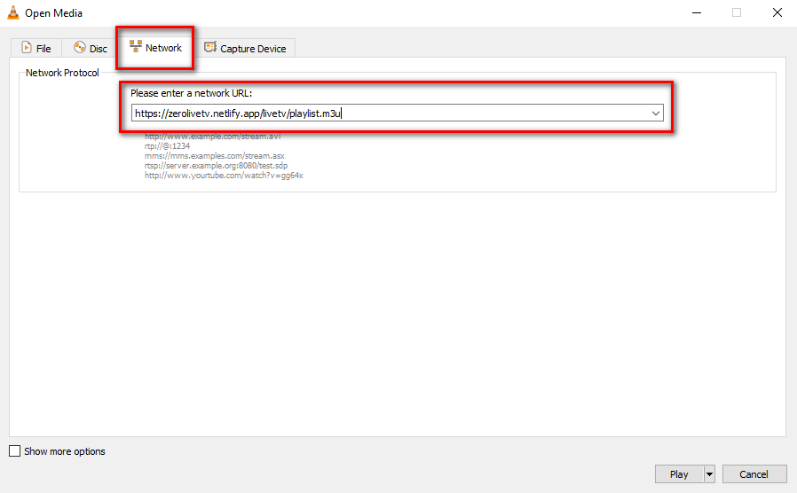

# IPTV

Internet Protocol television (IPTV) is the delivery of television content over Internet Protocol (IP) networks. 

## Usage

To watch IPTV you just need to paste this link `https://zerolivetv.netlify.app/livetv/playlist.m3u` to any player with support M3U-playlists.



Also you can instead use one of these playlists:

- `https://zerolivetv.netlify.app/livetv/playlist.m3u` (grouped by all country)
- `https://zerolivetv.netlify.app/livetv/vod.m3u` (grouped by movies)
- `https://zerolivetv.netlify.app/livetv/tvseries.m3u` (grouped by tv series)

Or select one of the playlists from the list below.

## Playlists by Zeroflix

<table>
	<thead>
		<tr>
		<th align="left">Category</th>
		<th align="right">Channels</th>
		<th align="left">Playlist</th>
		</tr>
	</thead>
	<tbody>
		<tr>
		<td align="left">Live Tv</td>
		<td align="right">Unknown</td>
		<td align="left"><code>https://zerolivetv.netlify.app/livetv/playlist.m3u</code></td>
		</tr>
		<tr>
		<td align="left">VOD</td>
		<td align="right">Unknown</td>
		<td align="left"><code>https://zerolivetv.netlify.app/livetv/vod.m3u</code></td>
		</tr>	
		<tr>
		<td align="left">TV Series</td>
		<td align="right">Unknown</td>
		<td align="left"><code>https://zerolivetv.netlify.app/livetv/tvseries.m3u</code></td>
		</tr>
	</tbody>
</table>


## For Developers

In addition to the above methods, you can also get a list of all available channels in JSON format.

To do this, you just have to make a GET request to:


- `https://zerolivetv.netlify.app/livetv/playlist.json` (grouped by all country)
- `https://zerolivetv.netlify.app/livetv/vod.json` (grouped by movies)
- `https://zerolivetv.netlify.app/livetv/tvseries.json` (grouped by tv series)


If successful, you should get the following response:

```
[ 
  {
    "name": "CNN",
    "logo": "https://domain.com/logo.png",
    "url": "http://somedomain.com/index.m3u8"    
  },
  {
    "name": "BBC",
    "logo": "https://domain.com/logo.png",
    "url": "http://somedomain.com/index.m3u8"    
  }  
]
```

## Issue
If you find an error or have any suggestions on how to organize a playlist, please send an [issue](https://github.com/zeroflixxyz/livetv/issues).
